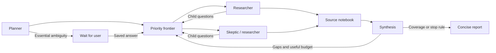

# Adaptive research harness

Research jobs launched in the UI use version 2: bounded parallel research with an evolving question frontier. Existing version-1 sequential jobs remain readable and can continue a saved clarification. Direct API clients may still request the legacy single-turn or sequential paths. See [ADR-0008](../adr/0008-server-owned-adaptive-research.md) and [ADR-0009](../adr/0009-project-owned-research-flow.md).

## Navigation and configuration

The Harness sidebar page contains global research defaults and technical reference only. It has no project selector, chat composer, run launcher, or run history. Research starts from a project chat by choosing Research next to Chat. The composer exposes per-run limits; the project Research tab owns run history, execution, source observations, and reports. Clarification, steering, and Stop stay in the same project chat.

`HarnessConfig.research` persists adaptive defaults; older registries receive the standard defaults when parsed. Each launch copies its chosen limits into the run. A per-run override does not change global defaults. Codex connection and model defaults remain on Configuration; research guidance and the global concurrency ceiling live on Harness.

The health endpoint exposes a shared API compatibility version. Before a mutation the browser verifies compatibility; an outdated server produces a clear restart/reload message and no mutation is sent. This guards against a long-running server serving newly rebuilt browser assets with an older request schema. Rebuilding static assets does not restart the production server.

## Execution graph

`packages/harness/src/adaptive.ts` owns guidance, frontier admission, source merging, context selection, and stopping policy. `apps/server/src/adaptive-research.ts` executes the loop; `turn-pool.ts` bounds provider concurrency across all jobs. React reads saved snapshots and never dispatches provider RPC.

The planner proposes independent research and skeptical assignments. The server validates and deduplicates normalized questions, admits them within task/depth limits, and selects highest priority first, then lower depth, creation time, and stable ID. Each selected assignment gets an isolated Codex thread. Researchers search multiple phrasings, read relevant pages, follow references, summarize consulted sources, and propose child questions. A separate synthesis turn reviews the notebook, gaps, contradictions, and pending frontier before selecting more research. These are model-guided judgments with deterministic server limits, not proof of factual accuracy.

## Budgets and context

Defaults: 3 parallel agents, 18 research assignments, depth 4, 6 cycles, 120 retained sources, and 45 minutes. Launch controls permit up to 6 parallel agents, 48 assignments, depth 8, 12 cycles, 500 sources, and 120 minutes. The configured global job/turn limit also applies. At most `maxTasks + maxRounds + 2` turns execute. Settings are snapshotted per run; the shared concurrency ceiling follows server configuration at job launch.

A cycle dispatches up to the per-run agent limit and waits for that batch before synthesis. Model-proposed directions cannot exceed admission budgets. Stop rules include source/cycle limits, two cycles without new source URLs, no admissible frontier, or a sufficient synthesis with at least one source and no unresolved gaps/contradictions. At a cycle boundary, the last 10% of elapsed-time budget is reserved for reporting; a hard deadline aborts unfinished execution and can prevent report completion.

Researchers return up to 24 useful consulted sources each. HTTP(S) URLs are normalized by removing fragments/tracking parameters and sorting queries. The notebook preserves separate agent observations for shared URLs; repeated summaries do not establish independent support. All retained evidence stays in the project. Context ranks source title/finding overlap with the assignment, then discovery recency; it selects up to 16 sources for research and 60 for other roles, with bounded excerpts. Oversized context drops source excerpts, reduces historical summaries, and finally shortens the clarification in the provider prompt; saved originals remain intact. This initial lexical selection can miss relevant evidence in a large notebook.

## Observability and tools

The dashboard exposes the agent tree, status, parent/depth/priority, pending frontier, source observations, synthesis, cycle decisions, stop reason, selected model, captured adapter request, thread/turn IDs, and web-tool trace. Reports default to 250–450 words unless the user requests another length. Long details stay behind disclosure controls.

The adapter allowlists native web `search`, `openPage`, and `findInPage` actions, queries, URLs, patterns, and lifecycle state. Missing arguments remain explicitly unavailable. The trace retains the latest 2,000 actions and reports the dropped count. Source budgets do not limit provider-internal web calls. The expert panel shows the actual process launch descriptor from the same helper used by `spawn`, plus JSON-RPC method names. Web actions are native provider tools, not invented shell commands. The captured per-agent request is adapter input, not an unfiltered wire transcript.

Only researcher/skeptic turns enable web search. Planner, synthesis, and reporter turns use structured context with web access disabled. Private reasoning, credentials, unrelated tool payloads, and raw diagnostics are excluded. Provider-native multi-agent tools, shell, filesystem writes, connectors, and external MCP tools remain disabled. The application owns delegation, cancellation, and report publication.

## Durability and failures

The versioned run snapshot stores all assignments, budgets, concise summaries, normalized source observations, bounded tool trace, decisions, requests, and run-level steering in the selected project folder. Saves are serialized immutable snapshots; source events are coalesced. Only reporter text streams into the conversation.

Essential clarification pauses and releases execution slots. A saved answer atomically claims the waiting run and is passed to subsequent agents, including after restart. Steering is stored durably for future assignments and sent to active children; a child that finishes concurrently may reject steering. Stop aborts active turns and removes queued work. A malformed research result marks that child failed and allows partial synthesis; provider or storage failures abort siblings and fail the run. Application restart marks abandoned active tasks interrupted without replay. Waiting tasks survive restart. Automatic crash replay and disconnected-drive guarantees are not implemented.

## Verification

Behavioral tests cover parallel branches, evolving child questions, deduplication, bounds, source observations, cancellation, malformed child results, infrastructure failure propagation, durable steering, clarification after restart, and dead-owner task recovery. Provider fixtures verify telemetry projection and restricted execution.

A live GPT-5.4-Mini / low run completed with two simultaneous researchers, eight retained sources, 21 real search/open/find actions, synthesis, and a saved report. It stopped at its source budget after one cycle. Two-cycle evolution, clarification, cancellation, and failure paths are fixture-verified. Browser checks cover trace filtering/arguments, topology selection, desktop and 390px layouts without horizontal overflow. See [verified progress](../memory/progress.md) for final validation.

Independent citation verification, experiments, connectors, distributed scheduling, and automatic replay remain deferred.
