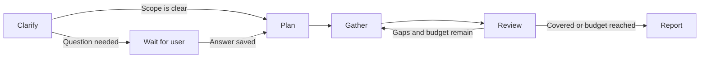

# Inspectable research harness

The Research harness sidebar page runs a sequential research workflow and shows its actual saved state. Existing Chat and focused Research jobs remain single-turn options. See [ADR-0007](../adr/0007-inspectable-sequential-harness.md) and the [implementation plan](../plans/research-harness.md).

## Graph and routing

`packages/harness/src/workflow.ts` is the authority for stage descriptions, tool availability, guidance, evidence normalization, and routing. The browser imports the same graph and tool catalog used to describe the server workflow.

Scope returns a concise summary and an optional question. A question pauses the job without keeping a provider turn open. Planning produces one to six research questions. Gathering uses live web research and returns structured sources. Review returns coverage gaps; the server decides whether another round is permitted. Report generation produces Markdown and the existing artifact writer saves it once.

## Budgets and evidence

Each launch snapshots one to five gathering rounds, one to forty retained sources, primary-source preference, research instructions, model, and thinking level. Later settings changes do not alter an active job. At most `3 + 2 × maxRounds` model turns execute. Each execution segment has a twenty-minute wall-clock limit; a clarification answer begins a new segment. There is at most one clarification pause.

The server removes URL fragments and common tracking parameters, sorts remaining query parameters, and keeps the first finding for each normalized URL. It stops retaining sources at the configured limit. This limit does not cap provider-internal search calls. Evidence includes a title, HTTP(S) URL, finding, model-assigned primary-source label, and discovery round. Stage completion timestamps provide checkpoint timing, not verified publication or access dates.

Review can repeat gathering only if gaps remain, the round budget remains, and the notebook has room. Otherwise it records the stopping reason and reports unresolved gaps. No confidence score or independent fact-check claim is manufactured. Source records, review judgments, and report citations remain model-authored.

## Provider and trust boundary

Every stage starts an isolated restricted provider thread with the bounded validated brief, user answer, preferences, plan, sources, and gaps. Only Gather uses provider Research mode; other stages use Chat mode with web search disabled. Raw previous transcripts and private reasoning are not passed between stages.

Scope, Plan, Gather, and Review request per-turn structured outputs and validate the response against shared schemas. The provider schema omits the unsupported JSON Schema `uri` format; the application still validates HTTP(S) URLs. Malformed output fails the run at its last valid checkpoint. Report text alone streams to the user. Provider tool arguments and reasoning stay private.

The existing read-only, no-approval, no-shell, no-external-MCP boundary is unchanged. Ask-user and evidence management are server operations. Report publication is an application operation, not model filesystem authority. In-turn steering applies to the current stage; later stages receive its validated result, not an unrestricted steering transcript.

## Persistence, cancellation, and restart

Each harness is a Research run with an optional versioned `harness` snapshot in the existing project document. Legacy jobs load with `harness: null`. Checkpoints contain stage, budgets, evidence, gaps, stage summaries, and clarification. No migration rewrites old data.

Waiting reserves its chat but releases live execution capacity. It survives an owner process exit. `POST /api/runs/:id/answer` validates the answer and atomically claims the waiting run under the project lock before launching a worker. Competing answers cannot both succeed. Stop can cancel waiting work from a new server process.

Stop during execution aborts the provider and is checked again before every stage. Restart interrupts active execution; no stage is automatically replayed. Valid checkpoints remain inspectable. Failed terminal writes use the existing in-memory reconciliation mechanism while the server remains alive; this is not crash-proof recovery from a disconnected drive.

The browser restores the harness destination and session-selected project/history after reload. The execution log and evidence views read authoritative project data. Failed or interrupted runs can be inspected and a new research run can be started; automatic checkpoint replay is deferred.

## Verification

- Algorithm tests: clarification routing, URL normalization, deduplication, source caps, repeat/stop decisions, malformed outputs, and supported provider schemas.
- Coordinator fixtures: full workflow/report, real round limits, waiting and continuation, duplicate answers, invalid output, stop while waiting, stop during gathering, and existing single-turn regression coverage.
- Storage tests: waiting survives dead-owner recovery and competing stores can claim only one answer.
- Provider fixture: the output schema reaches `turn/start` with execution restrictions intact.
- Browser walkthrough: launch, clarification, second gathering pass, source inspection, report, tool catalog, keyboard focus, and 390-pixel responsive layout without horizontal overflow.
- Live integration: GPT-5.4-Mini, low thinking, one gathering round, two retained sources, all five stages, and a saved Markdown report. Live clarification and cancellation remain fixture/browser-fixture coverage.

Recursive child agents, parallel research scheduling, independent source verification, experiments, connectors, and autonomous execution replay remain outside this version.
